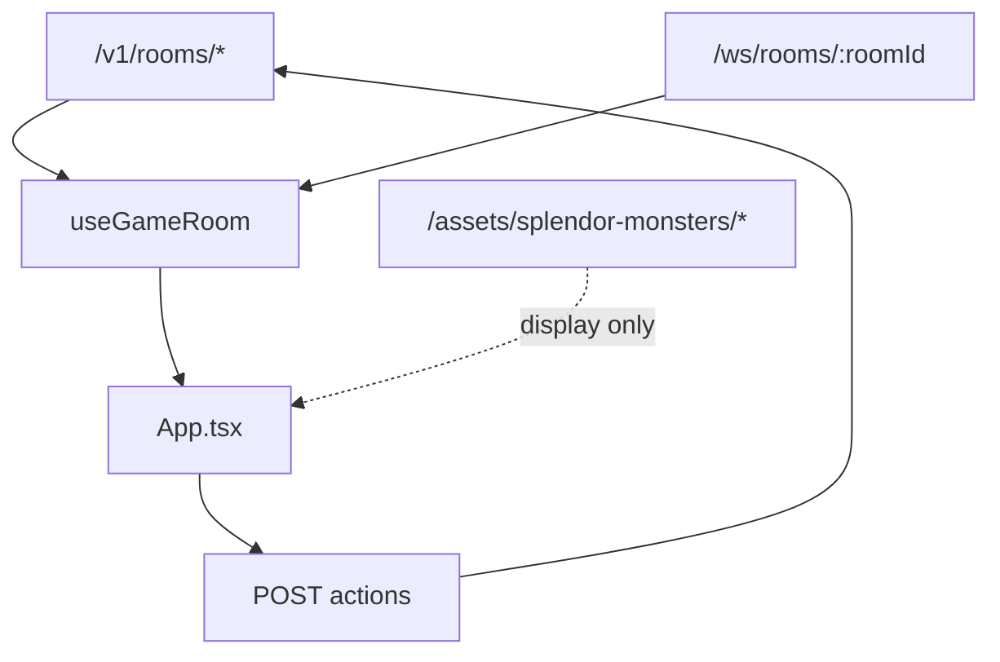

# 02-Dashboard 前端开发指导

## 一、适用范围

适用于 `frontend/dashboard/`、`scripts/sync-dashboard-assets.mjs`、`assets/splendor-monsters/` 的展示接入。

Dashboard 是浏览器操作台，不是规则引擎。

## 二、硬性边界

- 不 import `src/game/domain`、`src/game/application` 或 `src/game/infrastructure`。
- 不在前端计算权威分数、胜负、导师奖励或市场补牌。
- 不把图片资源、日志、选择态写成游戏事实。
- endpoint 失败必须展示错误。
- WebSocket 消息只能更新为服务端广播的 `room_state`。

## 三、数据流



## 四、UI 规则

- 首页第一屏必须能创建或加入房间。
- 游戏中优先展示当前玩家、资源银行、市场卡、玩家面板和日志。
- 使用图标按钮时优先使用 `lucide-react`。
- 禁止使用大篇说明文字代替可操作控件。
- 移动端要避免卡片和按钮文字溢出。
- 视觉资产应展示真实项目主题，不使用官方 IP 素材。

## 五、验证

默认验证：

```bash
source "$HOME/.nvm/nvm.sh" && nvm use 22 && npm run build:dashboard
source "$HOME/.nvm/nvm.sh" && nvm use 22 && npm run typecheck
source "$HOME/.nvm/nvm.sh" && nvm use 22 && npm test
```
