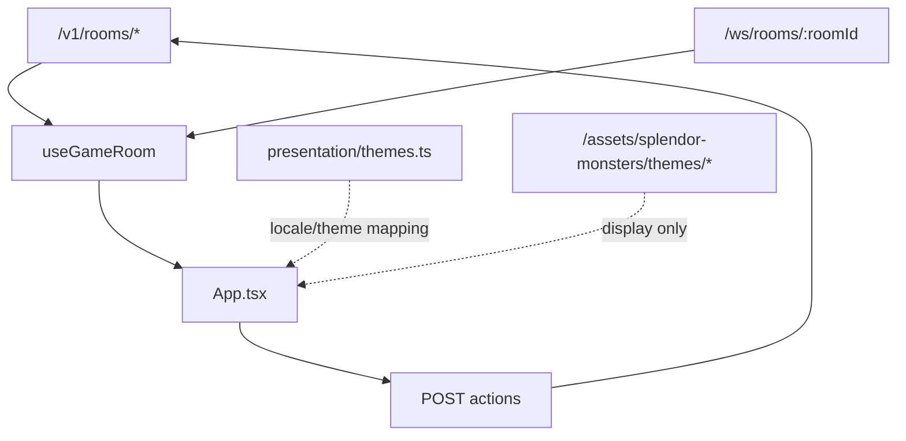

# 02-Dashboard 前端开发指导

## 一、适用范围

适用于 `frontend/dashboard/`、`frontend/dashboard/src/presentation/`、`scripts/sync-dashboard-assets.mjs`、`assets/splendor-monsters/` 的展示接入。

Dashboard 是浏览器操作台，不是规则引擎。

## 二、硬性边界

- 不 import `src/game/domain`、`src/game/application` 或 `src/game/infrastructure`。
- 不在前端计算权威分数、胜负、导师奖励或市场补牌。
- 不把图片资源、日志、选择态写成游戏事实。
- 不把 `locale` 或 `themeId` 写成领域规则。它们只决定显示文本和资源路径。
- endpoint 失败必须展示错误。
- WebSocket 消息只能更新为服务端广播的 `room_state`。

## 三、数据流



## 四、UI 规则

- 首页第一屏必须能创建或加入房间。
- 游戏中优先展示当前玩家、资源银行、市场卡、玩家面板和日志。
- 游戏桌面按标准比赛场地组织：玩家席位、资源银行、1/2/3 级市场（每级牌堆与 4 张公开卡）、罕见/传说特殊区、训练师人物、控制席位保留区和日志；布局层不得新增规则结算。
- 使用图标按钮时优先使用 `lucide-react`。
- 禁止使用大篇说明文字代替可操作控件。
- 移动端要避免卡片和按钮文字溢出。
- 视觉资产应展示真实项目主题；授权 Pokémon 资产可使用，范围以 `docs/license-scope.md` 为准。
- `zh-CN` 与 `en-US` 都必须能渲染主要 UI 文案、元素标签、卡牌显示名和导师显示名。
- 主题化卡牌文案应放在 `frontend/dashboard/src/presentation/`，例如 `creatureAcademy.ts`；不得写入服务端领域卡牌事实。
- Dashboard 支持本地同屏多人：浏览器可以记录多个本地可控 `playerId`，通过控制席位切换当前操作对象；该状态只影响提交动作时携带哪个 `playerId`，不改变服务端回合规则。
- 新增主题时同步更新 `asset-index.json`、`frontend/dashboard/src/presentation/themes.ts` 和对应 `image-generation/<theme-id>/` manifest。

## 五、资源结构

```text
assets/splendor-monsters/
  asset-index.json
  themes/
    elemental-league/
      arena-hero.png
    crystal-observatory/
      arena-hero.png
    creature-academy/
      arena-hero.png
      cards/
        card-art-atlas.png
        fire-t1.png
        fire-t2.png
        ...
    pokemon-splendor/
      arena-hero.png
      cards/
        pdf-t1-dratini-01.png
        pdf-rare-eevee.png
        ...
  image-generation/
    <theme-id>/
      arena-hero-manifest.json
      card-art-manifest.json
```

卡图支持两种展示策略：原创主题可使用 `cards/<element>-t<tier>.png`，授权 Pokémon 主题使用 `cards/<card-id>.png` 对应 PDF 实体卡面。前端只能把卡图作为 `CompanionCard` 的展示资源来读取，不允许让图片目录决定卡牌是否存在、费用、分数或回合结果。

授权 Pokémon 主题的逐卡素材必须由服务端 `CompanionCard.id` 驱动渲染，不能让素材文件反向创建卡牌事实。PDF 卡面抽取脚本为 `scripts/extract-pokemon-card-assets.py`，抽取 manifest 位于 `assets/splendor-monsters/image-generation/pokemon-splendor/card-face-extraction-manifest.json`。

## 六、验证

默认验证：

```bash
source "$HOME/.nvm/nvm.sh" && nvm use 22 && npm run build:dashboard
source "$HOME/.nvm/nvm.sh" && nvm use 22 && npm run typecheck
source "$HOME/.nvm/nvm.sh" && nvm use 22 && npm test
```
