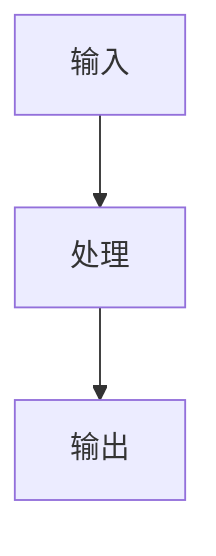
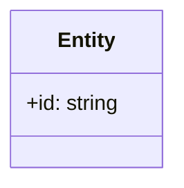
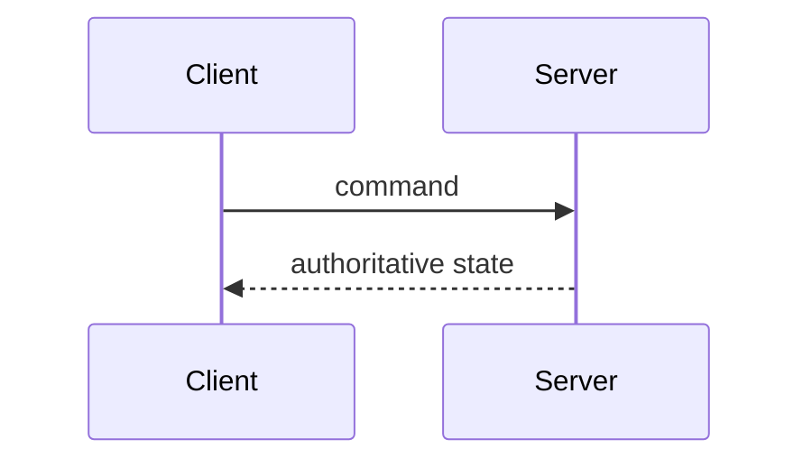

Use this skill when writing or updating any document under `docs/`.

## 写作标准

- 正文中文，代码标识、接口名、目录名和协议名保留英文。
- 先写结论、边界和数据流，再写背景。
- 图优先。模块边界、领域模型、结算流程、WebSocket 同步流程变化时必须使用 Mermaid。
- 不复制参考项目原文；必须改写为本项目的规则结算、多人房间和原创主题边界。
- 只更新受本次变更影响的文档。

## Mermaid 强制场景

| 场景 | 推荐图 |
| --- | --- |
| 新增或调整 bounded context | `flowchart` |
| 行动结算或同步流程变化 | `sequenceDiagram` |
| 领域实体、值对象或聚合变化 | `classDiagram` |
| API/WS 合约变化 | `sequenceDiagram` |

## 模块设计模板

````markdown
# <模块名>

## 概述

一句话说明职责和边界。

## 架构图



## 领域模型



## 核心流程



## 接口与契约

## 依赖关系

## 设计决策与约束
````

## 质量检查

- [ ] 图和文字没有重复堆叠。
- [ ] 文档没有把前端、日志或美术资源写成游戏事实来源。
- [ ] 规则、API、目录和实际代码一致。
- [ ] 外部资料有来源链接。
