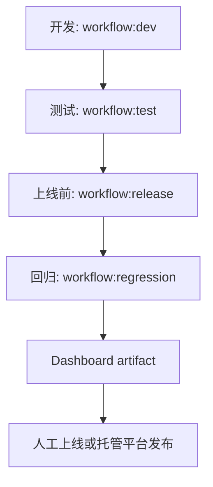
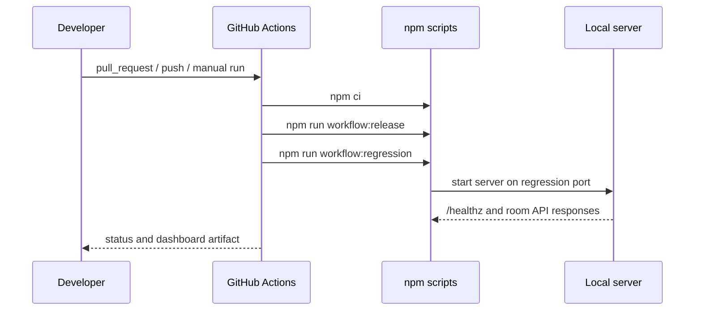

# 交付工作流

## 概述

本项目采用一条从本地开发到上线前验收的轻量交付工作流。目标是让每次规则、Dashboard、资产或网关改动都经过一致的质量门禁：开发检查、测试验证、上线构建、回归冒烟。

## 本地命令

| 阶段 | 命令 | 覆盖范围 | 通过标准 |
| --- | --- | --- | --- |
| 开发 | `npm run workflow:dev` | TypeScript 类型检查 | server 与 Dashboard 无类型错误 |
| 测试 | `npm run workflow:test` | 类型检查 + Vitest | 所有测试通过 |
| 上线前 | `npm run workflow:release` | 类型检查 + 测试 + Dashboard 构建 | `dist/dashboard` 可生成 |
| 回归 | `npm run workflow:regression` | Dashboard 构建 + HTTP 冒烟 + 关键业务回归 | 服务可启动，房间流程和买牌后进化回归通过 |
| 全量 | `npm run workflow:all` | 上线前检查 + 回归冒烟 | 全部阶段通过 |

## 自动化流程

GitHub Actions 配置在 `.github/workflows/delivery.yml`：

- `pull_request` 到 `main`：运行 `workflow:release` 与 `workflow:regression`。
- `push` 到 `main`：运行同一质量门禁，并上传 `dist/dashboard` artifact。
- `workflow_dispatch`：允许手动触发，可选择是否跳过回归冒烟。

## 回归覆盖

`scripts/regression-smoke.mjs` 覆盖以下业务路径：

- `/healthz` 健康检查。
- Dashboard shell 加载并引用构建后的静态资源。
- HTTP 房间流程：创建房间、加入玩家、开始游戏、读取合法行动、提交拿球行动、验证回合推进。
- 领域规则回归：购买卡牌后补齐 bonus，并在同一结算中完成进化。

该脚本使用 `SPLENDOR_REGRESSION_HOST` 和 `SPLENDOR_REGRESSION_PORT` 控制测试服务地址，默认端口为 `29988`，避免和本地开发服务 `19988` 冲突。

## 上线边界

当前仓库只提供上线前质量门禁和 Dashboard artifact，不直接执行生产部署。上线动作应由托管平台或人工发布流程完成，并满足以下条件：

- `workflow:release` 通过。
- `workflow:regression` 通过。
- 本次改动不包含 `.env`、授权合同、密钥或其他敏感材料。
- 若改动影响规则、API、WebSocket 或 Dashboard 行为，同步更新相关文档。

## 回滚与补救

- 若类型检查或测试失败，先修复代码，不进入构建或上线。
- 若回归冒烟失败，保留失败输出并复现 `npm run workflow:regression`。
- 若上线后发现规则或同步问题，优先回滚到上一条通过 `delivery.yml` 的 `main` 提交，再补充回归用例。
