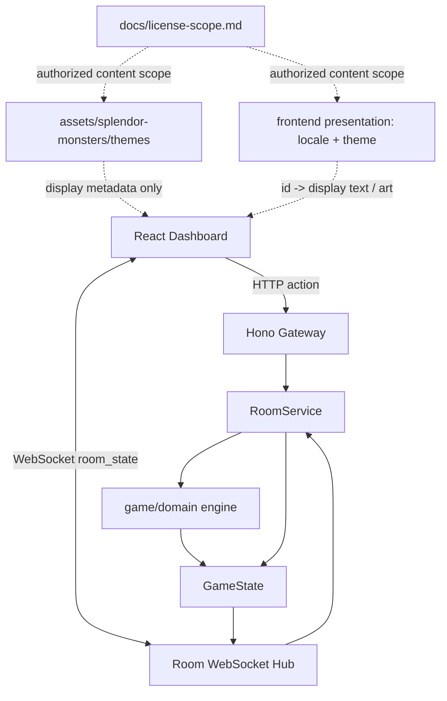
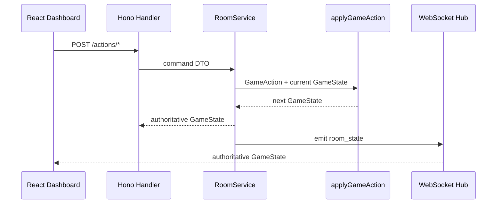

# Splendor Monsters TS 架构设计

## 一、系统定位

本项目是一个 TypeScript 多人线上桌游 MVP。规则基准切换为授权 Pokémon 版 Splendor：保留拿 ball/token、保留卡、捕获/购买卡、永久 bonus 与终局计分的资源引擎，并加入 Pokémon 版特有的进化机制、特殊卡区和 Master Ball 语义。

核心原则：

- 服务端游戏引擎是唯一事实写入者。
- 浏览器只提交行动意图，不直接改写 `GameState`。
- `GameAction -> domain settlement -> GameState` 是主链。
- HTTP 和 WebSocket 都是 delivery，不承载规则判断。
- 授权 Pokémon 美术资源仍只作为 display metadata，不能反向决定卡牌存在、费用、分数或胜负。

## 二、顶层架构



## 三、bounded context

| 模块 | 目录 | 职责 | 禁止事项 |
| --- | --- | --- | --- |
| game/domain | `src/game/domain` | 领域实体、行动校验、进化、特殊卡区、结算、计分、终局 | 依赖 Hono、WebSocket、React、DOM |
| game/application | `src/game/application` | 房间创建、加入、开始、行动编排 | 编写新的规则分支 |
| game/infrastructure | `src/game/infrastructure` | WebSocket hub、未来持久化适配 | 决定资源、分数、胜负 |
| gateway/http | `src/gateway/http` | HTTP API、静态资源映射 | 直接修改游戏状态 |
| dashboard | `frontend/dashboard` | 多人房间 UI 和操作入口 | import 服务端 domain/application |
| presentation | `frontend/dashboard/src/presentation` | 语言、主题、展示名和资源路径映射 | 改变权威 `GameState` 或结算规则 |

依赖方向：

```text
dashboard/browser -> HTTP/WS -> gateway -> application -> domain
                                      infrastructure -> application
```

## 四、规则权威边界

`GameAction` 是玩家意图。只有 `src/game/domain/engine.ts` 能把意图结算成新的 `GameState`。Pokémon 版新增的 `evolve_card`、特殊卡捕获和 Master Ball 结算也必须进入同一 settlement 边界。



## 五、MVP 边界

已纳入：

- 2-4 人房间。
- 本地进程内房间状态。
- 实时 WebSocket 广播。
- 拿资源、保留、购买、导师奖励、终局结算。
- 授权内容边界文档 `docs/license-scope.md`。
- `zh-CN` / `en-US` 展示语言与主题资源切换。
- `creature-academy` 当前仍是过渡主题，后续可替换或扩展为授权 Pokémon 主题。

待实现的 Pokémon 版规则：

- 卡牌进化：已捕获卡满足进化条件后，在回合末可选 1 次获得下一阶段卡。
- 特殊卡区：罕见/传说特殊卡区域，各自独立牌堆并各展示 1 张。
- Master Ball 语义：除万能支付外，是捕获罕见/传说卡的必要支付资源。
- AI Agent 行动空间扩展：除拿 token、保留、购买外，需要支持进化与特殊卡捕获。

展示主题约束：

- 主题只影响 Dashboard 文案、卡牌显示名、元素标签和图片资源。
- 服务端仍以稳定 id、元素枚举和 `GameState` 作为事实来源。
- 主题图片按 `assets/splendor-monsters/themes/<theme-id>/` 存放，生成元数据按 `image-generation/<theme-id>/` 存放。
- 卡图采用 `cards/<element>-t<tier>.png` 或逐卡授权素材策略。展示路径只由前端 `presentation` 层根据服务端卡牌 id、元素和等级派生，不能反向驱动规则。

暂不纳入：

- 账号系统和公网匹配。
- 数据库持久化。
- 授权范围外的官方 IP 美术、角色或复制卡牌数据。
