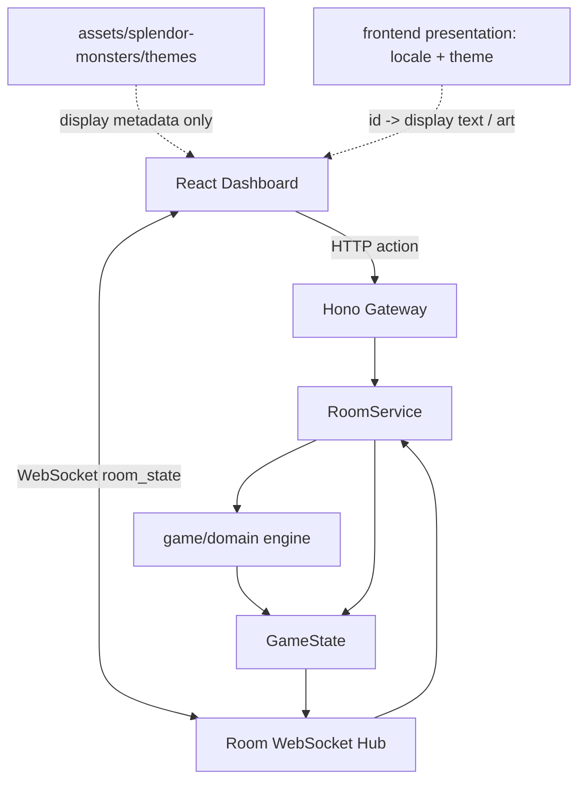
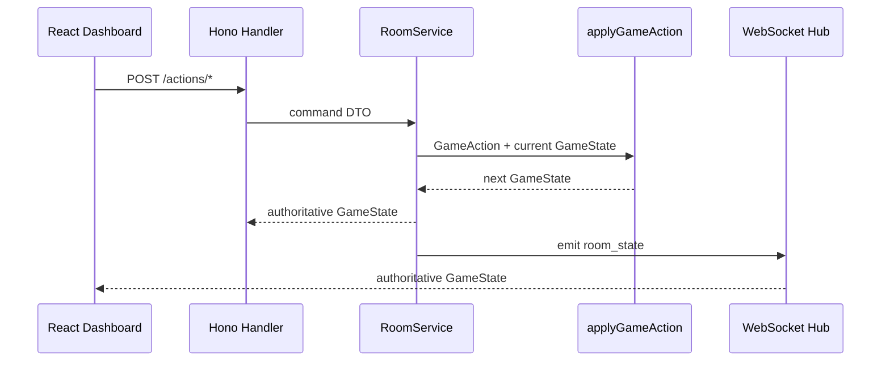

# Splendor Monsters TS 架构设计

## 一、系统定位

本项目是一个 TypeScript 多人线上桌游 MVP。规则骨架来自《璀璨宝石》式资源引擎：拿资源、保留卡、购买卡、获得永久折扣、达成导师条件并触发终局。主题层使用原创元素伙伴，不复制官方宝可梦或璀璨宝石美术资源。

核心原则：

- 服务端游戏引擎是唯一事实写入者。
- 浏览器只提交行动意图，不直接改写 `GameState`。
- `GameAction -> domain settlement -> GameState` 是主链。
- HTTP 和 WebSocket 都是 delivery，不承载规则判断。
- 美术资源只作为 display metadata。

## 二、顶层架构



## 三、bounded context

| 模块 | 目录 | 职责 | 禁止事项 |
| --- | --- | --- | --- |
| game/domain | `src/game/domain` | 领域实体、行动校验、结算、计分、终局 | 依赖 Hono、WebSocket、React、DOM |
| game/application | `src/game/application` | 房间创建、加入、开始、行动编排 | 编写新的规则分支 |
| game/infrastructure | `src/game/infrastructure` | WebSocket hub、未来持久化适配 | 决定资源、分数、胜负 |
| gateway/http | `src/gateway/http` | HTTP API、静态资源映射 | 直接修改游戏状态 |
| dashboard | `frontend/dashboard` | 多人房间 UI 和操作入口 | import 服务端 domain/application |
| presentation | `frontend/dashboard/src/presentation` | 语言、主题、展示名和资源路径映射 | 改变权威 `GameState` 或结算规则 |

依赖方向：

```text
dashboard/browser -> HTTP/WS -> gateway -> application -> domain
                                      infrastructure -> application
```

## 四、规则权威边界

`GameAction` 是玩家意图。只有 `src/game/domain/engine.ts` 能把意图结算成新的 `GameState`。



## 五、MVP 边界

已纳入：

- 2-4 人房间。
- 本地进程内房间状态。
- 实时 WebSocket 广播。
- 拿资源、保留、购买、导师奖励、终局结算。
- 原创视觉资源。
- `zh-CN` / `en-US` 展示语言与主题资源切换。

展示主题约束：

- 主题只影响 Dashboard 文案、卡牌显示名、元素标签和图片资源。
- 服务端仍以稳定 id、元素枚举和 `GameState` 作为事实来源。
- 主题图片按 `assets/splendor-monsters/themes/<theme-id>/` 存放，生成元数据按 `image-generation/<theme-id>/` 存放。

暂不纳入：

- 账号系统和公网匹配。
- 数据库持久化。
- 完整 10-token 后弃资源选择，MVP 先阻止超限行动。
- 官方 IP 美术、角色或复制卡牌数据。
