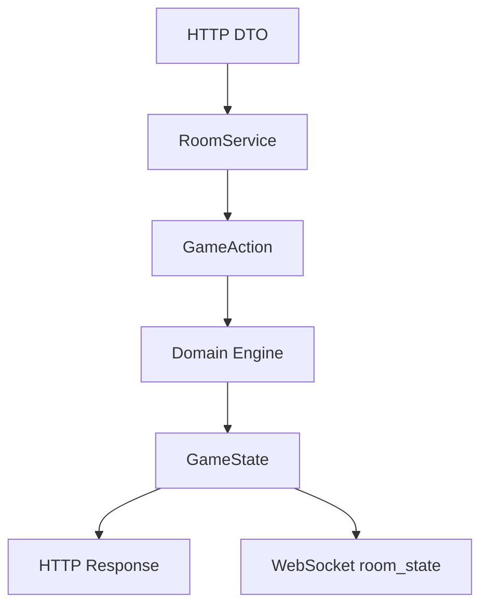
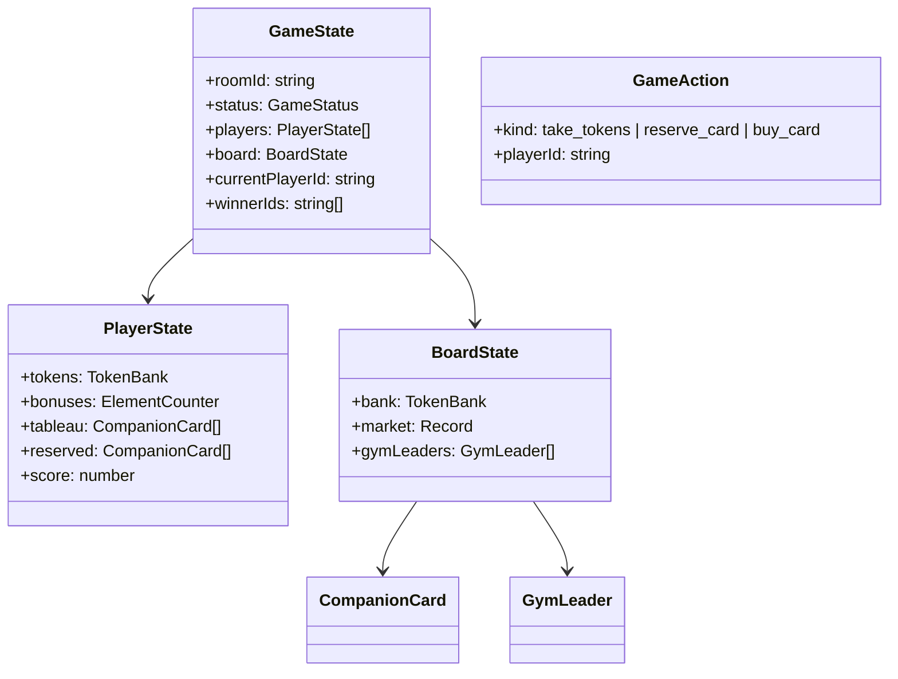
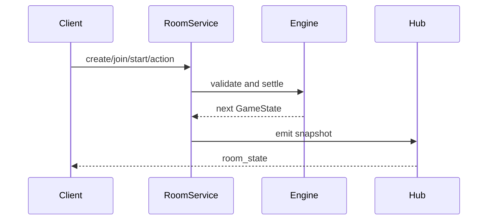

# 游戏引擎与房间同步

## 概述

游戏引擎负责结算 Splendor-style 行动并产出权威 `GameState`；房间同步负责把该状态广播给所有连接客户端。两者边界清晰：同步层只传输，不决定规则。

## 架构图

## 领域模型

## 核心流程

## 接口与契约

- `createLobbyState`: 创建 lobby 状态。
- `addPlayerToLobby`: lobby 期加入玩家。
- `startGame`: 初始化银行、市场、导师和回合。
- `applyGameAction`: 唯一行动结算入口。
- `RoomService`: 管理内存房间、调用 domain、触发广播。
- `RoomWebSocketHub`: 订阅 `RoomService` 并广播 `room_state`。

## 设计决策与约束

- MVP 使用内存房间。未来持久化应新增 repository/adapter，不改变 domain 规则入口。
- `RoomService` 返回 `structuredClone` 快照，避免调用方持有可变内部状态。
- 10-token 上限在 MVP 中通过拒绝行动处理。
