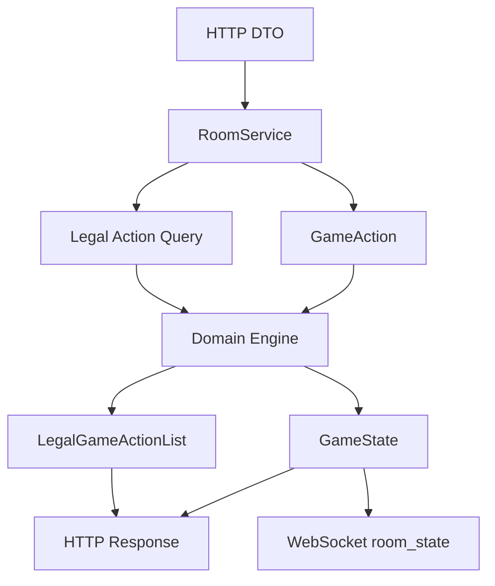
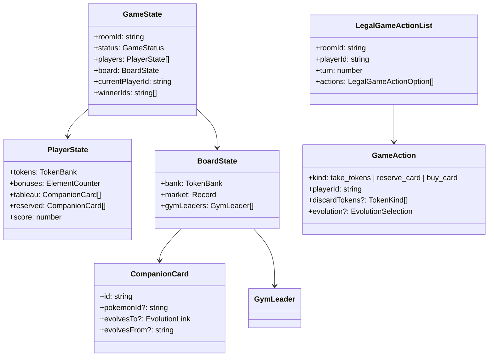
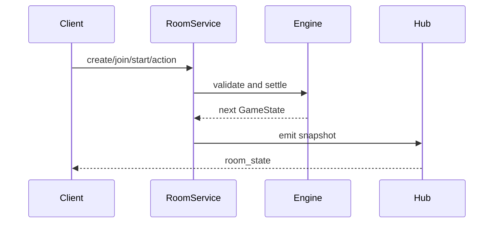
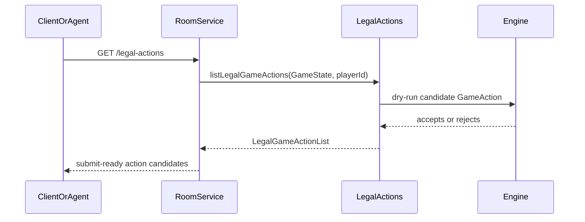

# 游戏引擎与房间同步

## 概述

游戏引擎负责结算 Pokémon 版 Splendor-style 行动并产出权威 `GameState`；房间同步负责把该状态广播给所有连接客户端。两者边界清晰：同步层只传输，不决定规则。

## 架构图

## 领域模型

## 核心流程

## 接口与契约

- `createLobbyState`: 创建 lobby 状态。
- `addPlayerToLobby`: lobby 期加入玩家。
- `startGame`: 初始化银行、市场、导师和回合。
- `applyGameAction`: 唯一行动结算入口。当前已覆盖拿 token、保留、购买、Pokémon 版补牌、弃到 10 个 token、回合末进化、特殊卡捕获和 Master Ball 语义。
- `listLegalGameActions`: 只读合法行动枚举。它生成主行动、弃球、可选进化的候选组合，并用 `applyGameAction` dry-run 过滤，返回可直接提交的 `GameAction`。
- `RoomService`: 管理内存房间、调用 domain、触发广播。
- `RoomWebSocketHub`: 订阅 `RoomService` 并广播 `room_state`。
- `GET /v1/rooms/:roomId/players/:playerId/legal-actions`: 面向 Dashboard 调试和 AI Agent 的合法行动查询；不改变状态，不触发 WebSocket。

## 设计决策与约束

- MVP 使用内存房间。未来持久化应新增 repository/adapter，不改变 domain 规则入口。
- `RoomService` 返回 `structuredClone` 快照，避免调用方持有可变内部状态。
- Pokémon 版规则允许行动后临时超过 10 个 token，然后公开弃到 10 个；弃 token 应作为服务端权威结算的一部分。
- Pokémon 版实体卡允许同名宝可梦出现多张不同卡。`CompanionCard.id` 表示唯一卡牌，`pokemonId` 表示进化匹配用的宝可梦种类。PDF 卡面上的进化要求印在源卡上，因此真实卡表应优先使用 `evolvesTo`。
- AI Agent 优先读取 `LegalGameActionList` 并选择其中一个 `GameAction` 提交；不得绕过 `applyGameAction` 直接写入进化、特殊卡、分数或胜者。
