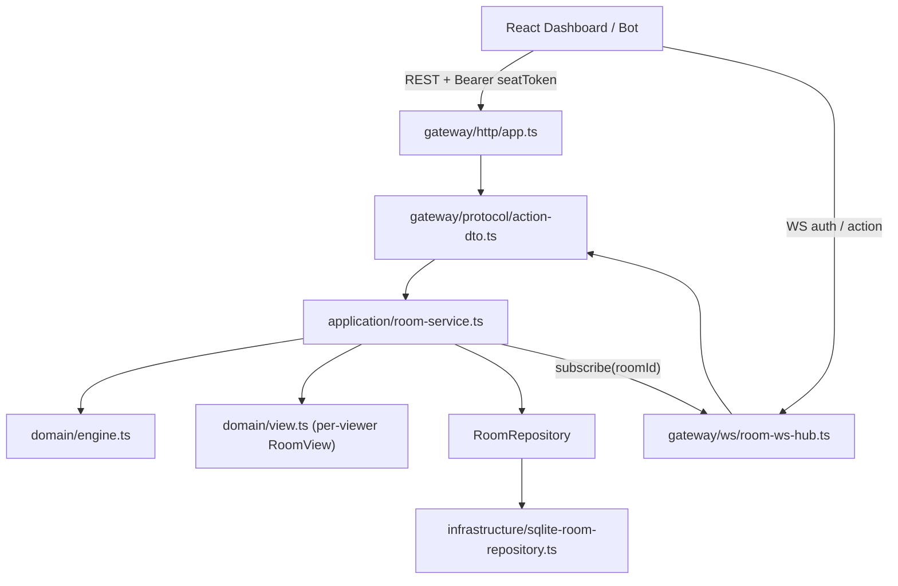

# 多人会话与多端同步

## 概述

本模块把「房间 + 席位」变成可在多台设备上安全游玩的会话：服务端权威、席位令牌鉴权、按观察者投影视图、WebSocket 实时推送、SQLite 快照持久化。规则结算仍只经过 `applyGameAction`（见 [01-游戏引擎与房间同步](./01-游戏引擎与房间同步.md)）。

## 分层

## 身份：席位令牌（seat token）

- 创建 / 加入房间时返回 `{ room, playerId, seatToken }`。`seatToken` 为 24 字节随机串（base64url），服务端只保存 sha256 哈希。
- 所有写操作只认令牌，**请求体里的 `playerId` 不再被信任**；行动者由令牌推导，杜绝冒充。
- HTTP 通过 `Authorization: Bearer <seatToken>`（或 `X-Seat-Token`）传递；WebSocket 连接后发送 `{type:'auth'}` 消息传递，令牌不出现在 URL 中。
- 多端续玩：Dashboard 的「复制席位链接」生成 `?room=<id>&seat=<token>`，另一设备打开后接管同一席位，并立刻从地址栏移除 `seat`。
- 后续接入 River Club 机器人授权 / 登录时，只需在「用户身份 → 签发 seatToken」这一层扩展，RoomService 的鉴权契约不变。

## 视图投影（防作弊）

`viewFor(roomId, viewerPlayerId)` 为每个观察者生成独立 `RoomView`：

- 牌堆只暴露数量：`board.deckCounts`、`board.specialDeckCounts`。
- 他人盲保留的牌显示为 `{ id: 'hidden-<pid>-<i>', tier, hidden: true }`；市场公开保留的牌对所有人可见。
- 附加字段：`version`（单调递增）、`viewerPlayerId`、`viewerCanPass`、`maxPlayers`。

## REST 接口

| 方法 | 路径 | 鉴权 | 说明 |
| --- | --- | --- | --- |
| GET | `/v1/rooms` | - | 房间列表 |
| POST | `/v1/rooms` | - | `{playerName, roomName?}` → SeatGrant |
| GET | `/v1/rooms/:id` | 可选 | 带令牌时返回该席位视图，否则观众视图 |
| POST | `/v1/rooms/:id/join` | - | `{playerName}` → SeatGrant |
| POST | `/v1/rooms/:id/start` | 房主 | 开局 |
| POST | `/v1/rooms/:id/demo-player` | 房主 | 本地演示席位 |
| POST | `/v1/rooms/:id/leave` | 席位 | 离开；对局中离开 → 该席位标记 `left`，只剩 1 人时结束 |
| POST | `/v1/rooms/:id/kick` | 房主 | `{playerId}` |
| POST | `/v1/rooms/:id/rematch` | 房主 | 已结束对局回到 lobby，保留仍在场的席位 |
| GET | `/v1/rooms/:id/legal-actions` | 席位 | 当前席位的可提交行动列表 |
| POST | `/v1/rooms/:id/actions` | 席位 | 通用行动，`kind` ∈ take_tokens / reserve_card / buy_card / pass_turn |
| POST | `/v1/rooms/:id/actions/{take-tokens,reserve,buy,pass}` | 席位 | 类型化行动端点 |

行动请求可带 `clientActionId`（≤64 字符）实现幂等：同一 id 重放直接返回当前状态，不重复结算。

错误映射：400 参数 / JSON 错误，401 令牌缺失或无效，403 非房主，404 房间不存在，409 规则拒绝，413 请求体超过 16KB，503 房间数达到上限。响应体统一为 `{ error_code, error }`。

## WebSocket 协议

连接 `/ws/rooms/:roomId`，初始为观众身份。

| 方向 | 消息 |
| --- | --- |
| C → S | `{type:'auth', requestId, seatToken}` |
| C → S | `{type:'action', requestId, action, clientActionId?}` |
| C → S | `{type:'ping', requestId?}` |
| S → C | `{type:'room_state', room, onlinePlayerIds}`：每次状态或在线变化时按观察者投影推送 |
| S → C | `{type:'auth_ok', requestId, playerId}` |
| S → C | `{type:'action_result', requestId, ok, version \| error_code, error}` |
| S → C | `{type:'room_closed', roomId}`，随后以 4410 关闭 |
| S → C | `{type:'pong'}` / `{type:'error', error_code, error}` |

关闭码：4404 房间不存在，4410 房间已关闭。服务端 30s 心跳，单条消息上限 16KB。客户端只接受 `version` 不回退、且 `viewerPlayerId` 与当前控制席位一致的视图。

## 生命周期与运维

- 回合超时：`SPLENDOR_TURN_TIMEOUT_SEC`（默认关闭）开启后，超时席位自动执行一个合法行动（优先拿球，否则 pass），每 5s 检查一次。
- 空闲回收：每 10min 清理一次，TTL 为 lobby / finished 2h、playing 24h；最后一名玩家离开时房间立即关闭。
- 房间上限：`SPLENDOR_MAX_ROOMS`（默认 200），超出返回 503。
- 持久化：`SPLENDOR_DB_PATH`（默认 `data/splendor.db`），每次结算后同步写快照，重启后恢复房间与令牌哈希。
- 前端产物目录：`SPLENDOR_DASHBOARD_DIST`（默认 `dist/dashboard`），可让预发实例读取独立构建，避免覆盖正在运行的实例。
- 优雅退出：SIGTERM / SIGINT 依次关闭 WS、HTTP、数据库，3s 后强制退出。

## 测试

- `test/room-service.test.ts`：冒充、牌堆/盲保留保密、幂等、房主权限、离开/重开、超时代打、回收、上限、SQLite 重启恢复。
- `test/http-app.test.ts`：各状态码、类型化/通用行动端点、base path。
- `test/ws-sync.test.ts`：真实端口 4 个客户端（房主手机 + 房主电脑 + 对手 + 观众）完整打完一局，逐步校验版本、当前玩家、银行和分数一致。
- `scripts/regression-smoke.mjs`：起独立进程与临时库，覆盖令牌鉴权、房主限制、盲保留保密。
